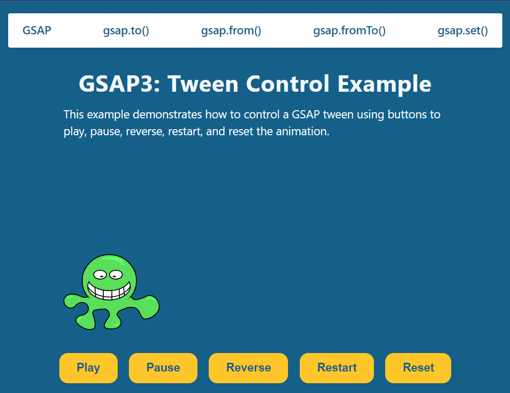

# GSAP3 Tween Control Example

A simple, responsive example demonstrating how to control a GSAP tween animation with play, pause, reverse, restart, and reset buttons.

## Features

- **GSAP Animation:** Animate a sprite (Fred) from left to right inside a centered container.
- **Tween Controls:** Play, pause, reverse, restart, and reset the animation with accessible buttons.
- **Responsive Design:** Layout adapts for desktop and mobile screens.
- **Modern UI:** Clean, modern navigation and button styles.
- **Accessible:** Keyboard and screen reader friendly.

## Demo

  
[View on CodePen](https://codepen.io/tk_dev/pen/GgJeyGe)

## Getting Started

### 1. Clone the repository

```sh
git clone https://github.com/tariq-k-dev/gsap3-tween-control-example.git
cd gsap3-tween-control-example
```

### 2. Open `index.html` in your browser

No build step required.

## Project Structure

```
.
├── images/
│   └── fred.svg
├── scripts/
│   ├── gsap-latest-beta.min.js
│   └── script.js
├── styles/
│   ├── reset.css
│   └── style.css
├── index.html
└── README.md
```

## How It Works

- The sprite starts at the left edge of the `.image` container.
- The GSAP tween animates the sprite to the right edge.
- Buttons allow you to control the animation state.
- The layout and controls are fully responsive.

## Customization

- Replace `fred.svg` with your own SVG or image for a different animation.
- Adjust the tween distance in `script.js` and container width in `style.css` as needed.

## License

## License

[MIT License](LICENSE)

---

Made with [GSAP](https://greensock.com/gsap/) and ❤️
